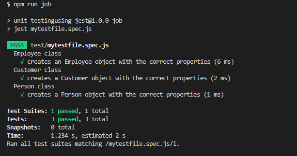
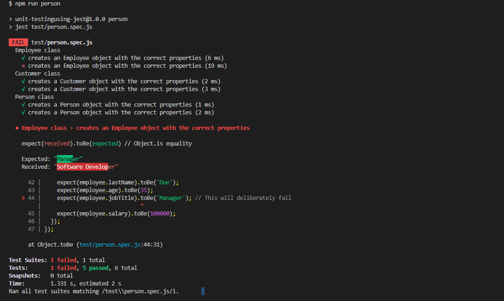

# My Awesome Application

This is a description of my awesome application. It does amazing things and solves important problems.

## Installation

To install the application, first clone the repository:

```bash
git clone https://github.com/NORZACO/UnitTestingUsingJest.git

```

Then, navigate to the project directory and install the dependencies:

```bash
cd my-awesome-application
npm install

```


## Usage
To run the Jest tests for the entire project, use the following command:

```bash
npm test
```


To run Jest tests for a specific file called person.spec.js in the test subdirectory, use the following command:


```bash
npm run person
```


You can also modify these scripts and add your own in the scripts object in package.json to suit your specific needs.

Contributing
If you'd like to contribute to this project, please follow the standard GitHub workflow:

#### Fork the repository
Create a feature branch
Make your changes and commit them with clear messages
Push your changes to your forked repository
Submit a pull request


### PASS TEST OF job file




### NOT PASS TEST OF person file




